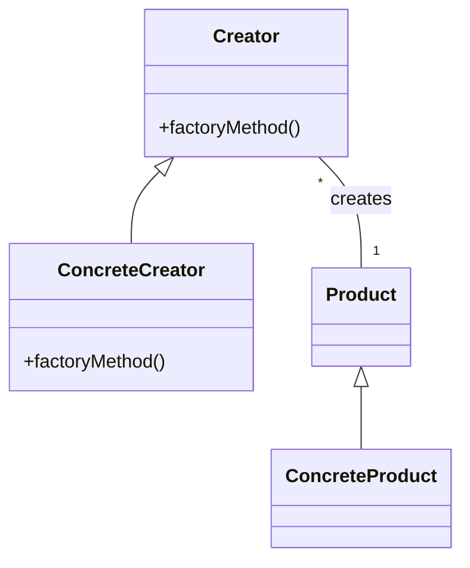

# Инструменты, паттерны, CI/CD

## Зачем это нужно

**Управление изменениями в коде.**
Без системы контроля версий легко «потерять» правки, не понять, кто и зачем их внёс. Git сохраняет историю и позволяет быстро откатываться.

**Повторное использование и читаемость.**
Шаблоны проектирования (паттерны) — это «рецепты», проверенные временем, которые помогают избежать «кода–spaghetti» и упрощают сопровождение.

**Автоматизация рутинных процессов.**
CI/CD-конвейер — это как автопилот: прогоняет тесты, собирает проект и выкатывает на сервер, пока команда фокусируется на фичах.

> **Аналогия**
> Представьте конвейер на заводе: детали поступают на одну сторону, проходят сборку и проверку качества на каждом этапе, а готовое изделие выходит с другой стороны — человек только загружает детали и забирает готовый продукт.
> В разработке CI/CD играет роль этого «заводского конвейера».

## Системы контроля версий

Git — это распределённая система контроля версий, которая помогает хранить историю изменений в коде и работать над ним коллективно, не теряя ни одной правки.

### Основные понятия и команды

#### Репозиторий (repository)

«Специальная папка», где Git хранит все версии файлов и историю изменений.

#### git clone

Скачиваем копию репозитория на свой компьютер.

```shell
git clone https://example.com/project.git
```

> Аналогия: копируете всю папку с проектом и историей изменений к себе, как скачиваете архив с документами.

#### git commit

Фиксируем текущие изменения в локальном репозитории.

```shell
git add file.txt
git commit -m "Добавил описание функций"
```

> Аналогия: делаете «снимок» документа в тот момент, чтобы потом было понятно, что и когда вы меняли.

#### Ветки (branches)

Позволяют работать над разными фичами параллельно, не мешая друг другу.

- **git branch** — показывает список веток.
- **git branch feature/login** — создаёт новую ветку для фичи “login”.
- **git checkout feature/login** — переключает на эту ветку.

> Аналогия: у вас есть основная копия текста (главная история), и вы делаете черновик на отдельном листе, чтобы не испортить оригинал.

#### git merge

Сливает изменения из одной ветки в другую

```shell
git checkout main
git merge feature/login
```

> Аналогия: когда черновик готов, вы переносите его правки обратно в основную версию.

### Стратегии ветвления

**Git Flow**
Чёткий процесс: есть ветки main (релизы), develop (текущая разработка), фичи (feature/_), релизные (release/_), багфиксы (hotfix/\*).
Подходит для команд, где важен строгий контроль версий и выпуска.

**Trunk-based development**
Все работают в одной ветке (main), но создают короткоживущие фичевые ветки, которые быстро сливаются (1–2 дня).
Минимизирует сложность слияний и ускоряет доставку.

### Практические советы

**Частые коммиты**
Делайте небольшие и логичные снимки состояния кода, чтобы легко было откатиться.

**Понятные сообщения**
В комментарии к коммиту кратко описывайте, что именно изменили и зачем.

**Короткоживущие ветки**
Избегайте веток, живущих дольше недели: слияние превратится в дорогую и циничную задачу.

**Код-ревью при слиянии**
Настройте обязательный review через Pull Request, чтобы несколько глаз проверили изменения перед merge.

## Паттерны проектирования

Шаблоны проектирования (design patterns) — это проверенные временем «рецепты» решения типовых задач при проектировании кода.
Они помогают сделать архитектуру чистой, гибкой и понятной другим разработчикам.

### Зачем нужны паттерны

**Повторное использование идей.**
Не изобретать велосипед: воспользоваться шаблоном, который уже давно отточен в индустрии.

**Единый «язык» команды.**
Когда вы говорите «используем Singleton», сразу понятно, что объект будет единственным в приложении.

**Упрощение поддержки.**
Код по шаблону легче читать, тестировать и расширять.

### Ключевые паттерны

#### Singleton

Гарантирует, что у класса есть только один экземпляр, и предоставляет глобальную точку доступа к нему.

Когда применять:

- Для логгера, пул соединений, менеджера конфигурации.

Реализация (псевдокод):

```python
class Singleton:
    _instance = None

    def __new__(cls):
        if cls._instance is None:
            cls._instance = super().__new__(cls)
        return cls._instance
```

#### Factory Method

Определяет интерфейс создания объекта, но позволяет подклассам выбирать, какой класс инстанцировать.

Когда применять:

- Когда нужно создавать семейства связанных объектов без жёсткой привязки к конкретным классам.

Mermaid-диаграмма:



#### Observer

Определяет зависимость «один ко многим» между объектами, так что когда один объект изменяет состояние, все зависимые уведомляются автоматически.

Когда применять:

- Для событийных систем, подписки–рассылки, обновления UI при изменении модели.

Псевдокод:

```python
class Subject:
    def __init__(self):
        self._observers = []

    def attach(self, obs):
        self._observers.append(obs)

    def notify(self, data):
        for obs in self._observers:
            obs.update(data)
```

#### Dependency Injection (DI)

Внедрение зависимостей извне вместо создания их внутри класса.

Когда применять:

- Для упрощения тестирования (можно «подмешать» мок-объект) и слабого связывания компонентов.

Пример:

```python
class Service:
    def __init__(self, repository):
        self._repo = repository  # репозиторий передаётся извне
```

#### Советы по использованию паттернов

**Не переусердствуйте.**
Паттерны упрощают, но неправильное применение может усложнить код.

**Выбирайте подходящие.**
Если вам нужен единый объект–конфигуратор, используйте Singleton. Если нужно уведомлять несколько слушателей — Observer.

**Комментируйте ссылки на паттерн.**
В комментариях к классу напишите, что вы применили, например, # Этот класс реализует Singleton.

## CI/CD-конвейеры

CI (Continuous Integration) и CD (Continuous Delivery/Deployment) — это практики и набор процессов, которые позволяют автоматически собирать, тестировать и доставлять ваш код на серверы, снижая ручной труд и риск ошибок.

### Определения

**Continuous Integration (CI)**
Автоматическая сборка и тестирование каждого изменения (коммита или pull request), чтобы гарантировать, что новый код не ломает существующую функциональность.

**Continuous Delivery (CD)**
Автоматизация выпуска артефактов в staging-среду или на production-готовое хранилище; код всегда находится в состоянии, готовом к деплою.

**Continuous Deployment**
Продолжение Continuous Delivery: каждый «зеленый» билд автоматически деплоится в production без ручного запуска.

### Компоненты типового пайплайна

**Сборка**
Компиляция кода, установка зависимостей, сборка frontend (webpack, npm) или backend (Maven, Gradle).

**Юнит-тесты**
Запуск автоматических тестов на уровне функций и классов.

**Статический анализ**
Проверка стиля (linters), поиск уязвимостей (SonarQube, ESLint, Pylint).

**Сборка артефакта**
Упаковка приложения в Docker-образ, JAR/WAR, ZIP или другой формат.

**Деплой на staging**
Автоматическое развёртывание в тестовую среду для ручного или автоматического тестирования.

**Интеграционные/приёмочные тесты**
Проверка взаимодействия модулей, API-эндпоинтов, производительности.

**Деплой на production**
Выпуск в боевую среду: Canary-релиз, Blue-Green деплоймент или Rolling Update.

### Инструменты для CI/CD

**Jenkins**
Гибкий, плагинный, сам настраивается; требует отдельного сервера.

**GitHub Actions**
Встроенные в GitHub воркфлоу; простая интеграция с репозиторием.

**GitLab CI/CD**
Полноценная встроенная система, не требует внешних серверов.

**Azure Pipelines**
Часть Azure DevOps; хорошо работает с облачной инфраструктурой Microsoft.

### Практические приёмы

**Параллелизация шагов**
Запускайте юнит-тесты, линтинг и сборку артефакта параллельно, чтобы ускорить весь пайплайн.

**Кеширование зависимостей**
Храните кэш npm/Maven/Gradle между сборками, чтобы не скачивать их каждый раз.

**Пайплайн-изоляция для PR**
Для pull request запускайте весь набор тестов и анализ, но не деплойте — это защитит production от «грязных» веток.

**Триггеры и оповещения**
Настройте оповещения в Slack/Teams при падении сборки или успешном релизе.

**Использование инфраструктуры как кода**
Определяйте стенды (стейджинг, прод) в Terraform или Ansible и запускайте их через тот же пайплайн.

## DevOps-инструменты и инфраструктура

Чтобы код не только собирался и тестировался, но и надёжно работал в разных средах, применяют следующие инструменты:

- **Контейнеризация**
  - **Docker** — упаковка приложения и всех зависимостей в контейнер, который одинаково работает везде.
  - **Docker Compose** — оркестрация нескольких контейнеров (БД, кэш, приложение) на локальной машине.
- **Оркестрация и масштабирование**
  - **Kubernetes** — система управления кластером контейнеров: автоматический деплой, скейлинг и восстановление подов.
  - **Helm** — менеджер пакетов для Kubernetes, упрощает установку и обновление приложений.
- **Конфигурация и инфраструктура как кода**
  - **Terraform** — описываете облачные ресурсы (VM, сети, балансировщики) в конфиг-файлах, затем «apply» — и инфраструктура создаётся автоматически.
  - **Ansible** — декларативные плейбуки для настройки серверов, установки ПО и управления конфигурацией.
- **Мониторинг, логирование и алерты**
  - **Prometheus + Grafana** — сбор метрик (нагрузка CPU, задержки, количество ошибок) и построение дашбордов.
  - **ELK-стек (Elasticsearch, Logstash, Kibana)** — агрегирует логи с разных сервисов и позволяет искать ошибки по тексту.
  - **Alertmanager / PagerDuty** — отправка уведомлений (Slack, email, смс) при превышении порогов.

### Лучшие практики и советы

**Shift-Left Testing**
Перенос тестирования «влево»: пишите и прогоняйте тесты уже на этапе разработки фичи, а не после сдачи спринта.

**GitOps**
Управление инфраструктурой и конфигурацией через Git-репозиторий: любая правка в коде (Terraform, Helm-чарты) автоматически применяется к стендам.

**Авто-генерация документации**
Интегрируйте Swagger/OpenAPI для автоматической публикации спецификаций API сразу после билдa.

**Хранилище артефактов**
Используйте Artifactory, Nexus или GitHub Packages для сохранения собранных пакетов, контейнеров и бинарей — чтобы не зависеть от внешних репозиториев.

**Канареечный и Blue-Green деплоймент**
Выпускайте новую версию сначала для небольшой группы пользователей или в отдельный «зелёный» кластер, проверяйте, а затем переключайте трафик целиком.
