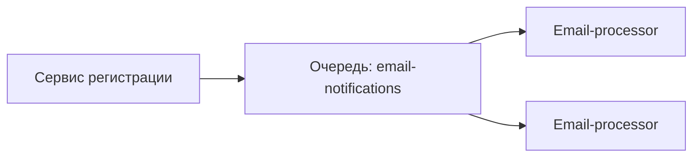

# Инфраструктура: Базы данных, кэш, очереди

## Почему инфраструктура важна

**Производительность**
Неправильный выбор БД или отсутствие кэша может привести к задержкам в ответах и неудовлетворённым пользователям.

**Надёжность**
Очереди помогают «пережить» временные сбои внешних сервисов и не терять данные.

**Масштабируемость**
Разделение нагрузки между БД, кэшем и обработчиками очередей позволяет системе расти без «узких мест».

> **Аналогия**
> Представьте ресторан:
>
> - База данных — это кухня, где готовят блюда по заказам.
> - Кэш — это горячий стеллаж с уже готовыми порциями для быстрых заказов.
> - Очередь — это список будущих заказов, который шеф-повар берёт по готовности и обрабатывает по очереди.

## Реляционные vs NoSQL базы данных

При выборе хранилища данных важно понимать, как оно хранит информацию и какие гарантии даёт.

### Реляционные СУБД (RDBMS)

Табличное хранение данных по предварительно заданной схеме (Schema-on-Write). Каждая запись — строка таблицы, столбцы — заранее определённые поля.

**Плюсы**

- ACID-гарантии (Atomicity, Consistency, Isolation, Durability) — данные остаются целостными даже при сбоях.
- Мощный язык запросов (SQL) позволяет делать сложные JOIN’ы и фильтрации.
- Широко распространены: PostgreSQL, MySQL, Oracle, SQL Server.

**Минусы**

- Жёсткая схема — сложнее вносить изменения в структуру таблиц на ходу.
- Вертикальное масштабирование — чаще всего масштабируют одной мощной машиной.

### NoSQL базы данных

Нереляционные хранилища с гибкой или отсутствующей схемой (Schema-on-Read).

Существует несколько типов:

- Документоориентированные (MongoDB, CouchDB) — данные хранятся в формате JSON-подобных документов.
- Ключ-значение (Redis, DynamoDB) — простейшее хранилище пар «ключ–значение».
- Колончатые (Cassandra, HBase) — оптимизированы для аналитики по большим объёмам.
- Графовые (Neo4j) — хранят узлы и связи, удобны для социальных сетей и рекомендаций.

**Плюсы**

- Горизонтальное масштабирование — легко добавлять новые узлы.
- Гибкая схема — можно хранить разные атрибуты в документах разных структур.
- Высокая доступность — многие системы проектированы с репликацией «из коробки».

**Минусы**

- Отсутствие полного ACID — часто выбор в пользу BASE (Basically Available, Soft state, Eventual consistency).
- Ограниченные возможности запросов — сложные JOIN’ы и транзакции могут не поддерживаться.

### CAP-теорема и применимость

**Consistency (Согласованность)**: все узлы видят одни и те же данные одновременно.
**Availability (Доступность)**: каждый запрос получает ответ (даже «устаревший»).
**Partition Tolerance (Устойчивость к разделению)**: система продолжает работу при разрывах между узлами.

RDBMS обычно фокусируются на Consistency + Availability, но менее устойчивы к разделениям.

NoSQL часто проектируются для Availability + Partition Tolerance, жертвуя моментальной согласованностью.

### Когда выбирать

| Сценарий                                      | RDBMS                                  | NoSQL                                  |
| --------------------------------------------- | -------------------------------------- | -------------------------------------- |
| Жёсткие транзакции и сложные связи            | Да                                     | Нет                                    |
| Быстрый рост данных и пиковые нагрузки        | Труднее (вертикальное масштабирование) | Легко (горизонтальное масштабирование) |
| Гибкая структура данных, частые изменения     | Сложно                                 | Просто                                 |
| Аналитика и отчёты с JOIN’ами                 | Отлично                                | Ограниченно                            |
| Геораспределённые приложения со слабой связью | Не лучший выбор                        | Отличный выбор                         |

> **Пример** >**RDBMS**: банковская система, где нужен точный баланс по счёту и все операции оборачиваются в транзакцию.
> **NoSQL (документоориентированная)**: каталог товаров интернет-магазина, где каждый товар имеет разнообразные атрибуты и постоянное добавление новых типов.

## Кэширование

Кэширование помогает снизить нагрузку на основную базу данных и ускорить ответ системы, сохраняя «горячие» данные в более быстром хранилище.

### Зачем нужен кэш

**Уменьшение задержек**
Вместо того чтобы каждый раз ходить в базу, можно сразу взять данные из кэша (память в RAM или быстрый key–value store).

**Снижение нагрузки на БД**
Часто запрашиваемые данные хранятся в кэше, и основной сервер БД обрабатывает меньше запросов.

**Экономия ресурсов**
Меньше CPU и I/O на БД-сервере, быстрее отрабатывают пики трафика.

> **Аналогия**
> В ресторане шеф заранее выкладывает несколько самых популярных блюд на горячий стеллаж: посетитель сразу берёт выдачу, а кухне не нужно готовить каждый раз с нуля.

### Основные подходы

**Cache-Aside (наиболее распространённый)**
Клиент сам проверяет кэш → при miss получает из БД → кладёт результат в кэш.

**Write-Through**
При записи данные пишутся одновременно в кэш и в БД.
Гарантирует, что кэш всегда синхронизирован.

**Write-Back (Write-Behind)**
Сначала пишем только в кэш, а в БД отложенно (через заданный интервал или при эвикции).
Позволяет снизить нагрузку на БД, но есть риск потери данных при сбое.

### Инструменты

**Redis**
Быстрое in-memory хранилище, поддерживает TTL (Time To Live), структуры данных (строки, списки, хэши).

**Memcached**
Простой кэш key–value, очень лёгкий и быстрый, но без сложных структур и без персистентности.

### Советы по работе с кэшем

**Устанавливайте TTL**
Задавайте разумное время жизни кэша (например, 5–60 минут) — чтобы данные не устаревали.

**Инвалидация**
При изменении данных сбрасывайте (удаляйте) соответствующие ключи, чтобы в кэше не хранились «мусорные» значения.

**Грейс-фолл (Graceful Degradation)**
Если кэш недоступен, система должна продолжать работать, обращаясь напрямую в БД.

**Мониторинг показателей**
Отслеживайте показатели hit ratio (сколько запросов обслужено из кэша) и latency, чтобы вовремя настраивать размеры и политики кэширования.

## Очереди и брокеры сообщений

Очереди сообщений позволяют отделить производителя событий (producer) от их обработки потребителем (consumer), обеспечивая асинхронность и надёжность.

### Зачем нужны очереди

**Асинхронность**
Producer отправляет сообщение в очередь и продолжает работу, не дожидаясь обработки.

**Разгрузка пиков**
При всплесках нагрузки сообщения накапливаются в очереди, а потребители обрабатывают их медленным, но стабильным темпом.

**Надёжность**
В случае сбоя потребитель может перезапуститься и продолжить обработку с места остановки, сообщения не теряются.

### Популярные системы

**RabbitMQ**
Брокер AMQP с поддержкой обменников (exchanges) и маршрутизации (routing).
Подходит для сложной маршрутизации сообщений и гарантий доставки «по крайней мере один раз» (at-least-once).

**Apache Kafka**
Распределённая платформа стриминга с хранением лога сообщений.
Предназначена для очень высоких нагрузок, аналитики в реальном времени и событийных систем.

### Пример использования

**Сценарий**: отправка email-уведомлений после регистрации пользователя.

- Пользователь регистрируется → сервис регистрации публикует сообщение в очередь email-notifications.
- Email-processor (consumer) слушает очередь и берёт сообщения по одному.
- Для каждого сообщения формируется письмо и отправляется через SMTP.
- Если отправка не удалась, сообщение может быть возвращено в очередь или перенаправлено в dead-letter очередь для последующего анализа.

### Гарантии доставки

**At-Least-Once**
Сообщение может быть доставлено более одного раза (дубликаты), но не будет потеряно.

**At-Most-Once**
Сообщение доставляется не более одного раза, но возможно потеря при сбое.

**Exactly-Once**
Сообщение обрабатывается ровно один раз; сложнее в реализации, требует идемпотентности и транзакций.

### Советы по работе с очередями

**Используйте Dead-Letter Queues**
Неудачно обработанные сообщения перенаправляйте в отдельную очередь для последующего разбора.

**Идемпотентность**
Делайте обработку сообщений идемпотентной, чтобы дубли не приводили к повторным побочным эффектам.

**Мониторинг задержек и длины очереди**
Следите за показателями “queue depth” и “processing time” — если очередь растёт, нужно масштабировать consumers.

**Разделение очередей по приоритету**
Используйте разные очереди для критичных и некритичных задач, чтобы важные сообщения обрабатывались быстрее.

## Комбинация компонентов

Часто в реальных системах нужно объединить базу данных, кэш и очередь, чтобы обеспечить и надёжность, и производительность.

### Пример архитектуры веб-приложения

- Запись данных
  - Клиент отправляет POST-запрос на создание заказа.
  - Сервис заказов сохраняет данные в реляционной БД (PostgreSQL) — основная «истина».
  - Сервис кладёт ключ заказа в кэш (Redis) для быстрого чтения часто запрашиваемого списка последних заказов.
  - Затем публикует сообщение в очередь (RabbitMQ) о новом заказе, чтобы downstream-сервисы (например, нотификатор, аналитика) могли обработать событие асинхронно.
- Чтение данных
  - Клиент запрашивает список последних заказов.
  - Сервис сначала проверяет Redis (cache-aside) — если есть (hit), возвращает результат за миллисекунды.
  - Если нет (miss), запрашивает данные из PostgreSQL, кладёт их в Redis с TTL, и возвращает клиенту.
- Асинхронная обработка
  - Email-сервис слушает очередь и отправляет уведомления о новых заказах.
  - Аналитический сервис слушает ту же или другую очередь и записывает события в хранилище для отчётов.

## Лучшие практики и наблюдения

**TTL и инвалидация**

- Устанавливайте разумный TTL в кэше (например, 5–15 минут для данных, которые обновляются нечасто).
- При изменении критичных данных явно удаляйте соответствующие ключи из Redis, чтобы не обслуживать устаревшую информацию.

**Мониторинг и алерты**

- База данных: отслеживайте задержки запросов, процент ошибок, размер пула соединений.
- Кэш: метрика hit ratio и latency, размер памяти.
- Очередь: глубина очереди (queue length), время ожидания сообщений (queue wait time).

**Гарантии доставки сообщений**

- Для важных задач настраивайте at-least-once доставку и реализуйте идемпотентные обработчики, чтобы не допустить дублирования.
- При необходимости используйте dead-letter queue для «токсичных» сообщений.

**Разделение ответственности**

- Отдельные сервисы и базы под чтение (read replicas) и запись (master), чтобы не блокировать основную БД.
- Горизонтальное масштабирование потребителей очередей при росте нагрузки.

**Документируйте архитектуру**

- Обновляйте ER-диаграммы, flowchart’ы кэша и очередей в едином репозитории (Git + Mermaid), чтобы новая команда сразу понимала, как всё работает.
