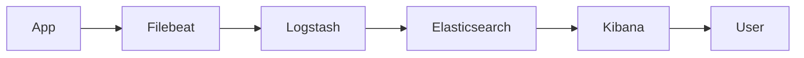
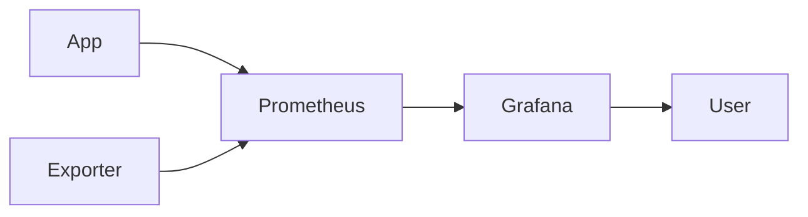
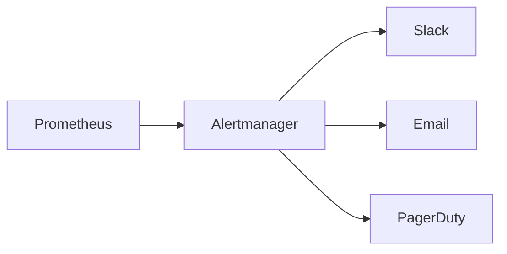

# Мониторинг, логирование и аудит

## Почему это важно

**Быстрое обнаружение проблем**
Без метрик и алертов вы узнаёте об инциденте только от пользователей. Мониторинг же сигнализирует о сбоях ещё до того, как они станут критичными.

**Разбор инцидентов и постмортем**
Логи позволяют понять, что именно произошло — какой запрос упал, какие параметры передавались, в каком месте кода.

**Соответствие нормам и аудит безопасности**
В некоторых отраслях (банки, медицина) важно знать, кто и когда менял данные. Без аудита вы не пройдёте проверку.

> **Аналогия**
> Представьте, что вы управляете фабрикой:
>
> - **Мониторинг** — это датчики, которые говорят вам о температуре, давлении и скорости конвейера.
> - **Логи** — это журналы операторов и видеозаписи; когда произошёл сбой, вы просматриваете запись, чтобы понять причину.
> - **Аудит** — это протокол, кто заходил в комнату управления и какие кнопки нажимал.

## Логирование

Логирование — это процесс записи событий, которые происходят в приложении, в специально отведённые файлы или системы.
Это помогает отлаживать код и расследовать инциденты.

### Зачем нужны логи

**Отладка и диагностика**
При ошибках логи показывают, где и почему упал код (stack trace, входные параметры).

**Анализ производительности**
Запись времени начала и окончания операций помогает понять узкие места.

**Расследование инцидентов**
По логам восстанавливают хронологию событий: какие действия совершились до сбоя.

**Аудит действий**
Фиксация изменений данных и доступа пользователей.

### Уровни логов

| Уровень   | Описание                                                                        |
| --------- | ------------------------------------------------------------------------------- |
| **DEBUG** | Подробная информация для разработчиков (вхождения/выходы функций, переменные).  |
| **INFO**  | Общие сообщения о нормальных событиях (запуск сервиса, успешная операция).      |
| **WARN**  | Предупреждения о потенциальных проблемах (высокая нагрузка, истекающий ресурс). |
| **ERROR** | Ошибки, которые требуют внимания, но позволяют сервису продолжить работу.       |
| **FATAL** | Критические сбои, после которых сервис не сможет продолжить работу.             |

> **Совет**
> В продакшене обычно включают уровни INFO и выше, а уровень DEBUG активируют при расследовании проблем.

### Формат и структура логов

Текст vs JSON

- Текстовые логи просты, но их сложнее парсить автоматически.
- JSON-логи структурированы, легко анализируются и индексируются (например, в Elasticsearch).

Обязательные поля

- timestamp — метка времени (UTC)
- level — уровень события
- service — имя приложения или модуля
- message — текстовое описание
- Дополнительные поля (context): request_id, user_id, transaction_id

```json
{
  "timestamp": "2025-05-21T14:32:10Z",
  "level": "ERROR",
  "service": "order-service",
  "message": "Payment failed",
  "request_id": "abc123",
  "user_id": 42,
  "error": "Insufficient funds"
}
```

### Инструменты для сбора логов

**Filebeat / Fluentd** - агенты, которые собирают логи с серверов и отправляют в центральный обработчик.

**Logstash** - обрабатывает, фильтрует и трансформирует логи перед отправкой в хранилище.

**Elasticsearch** - хранилище и поисковый движок для больших объёмов логов.

**Kibana** — визуализация и построение дашбордов по логам.

Поток логов от приложения до конечного визуального интерфейса.



### Практические советы

**Корреляционные идентификаторы**
Присваивайте каждому запросу request_id и передавайте через все слои, чтобы объединять логи одного сценария.

**Ротация логов**
Настройте ротацию (logrotate) и удаление старых файлов по политике хранения (например, 7–14 дней).

**Фильтрация чувствительных данных**
Не записывайте в логи пароли, персональные данные или номера карт.

**Мониторинг ошибок**
Настройте алерты на превышение порога ошибок (например, более 5 ERROR в минуту).

## Метрики и мониторинг

Мониторинг — это сбор и анализ числовых показателей (метрик) о работе системы, которые помогают обнаружить проблемы ещё до того, как они станут критичными.

### Типы метрик

**Системные метрики**
CPU, RAM, Disk I/O, Network — ресурсы сервера, которые показывают, не перегружен ли хост.

**Метрики приложения**
Latency (время ответа), Error Rate (доля ошибок), Throughput (число запросов в секунду).

**Бизнес-метрики**
Conversion Rate (конверсия), Active Users, Completed Orders.

**Пользовательские метрики**
Любые специфичные для вашего приложения счётчики, тайминги и гистограммы.

> **Аналогия**
> Системные метрики — это как показатели щитка автомобиля (топливо, температура), а бизнес-метрики — как пробег и расход топлива для оценки эффективности поездки.

### Инструменты

**Prometheus**
Агент-«scraper», который опрашивает (scrape) экспортёры на ваших сервисах и сохраняет метрики во временной базе.
Метрики хранятся в формате ключ–значение с метками (labels), например:

```pgsql
http_request_duration_seconds{service="order",method="POST",code="200"} 0.345
```

**Grafana**
Визуализация метрик из Prometheus: строит графики, дашборды, уведомления.
Позволяет комбинировать системные и бизнес-метрики на одном экране.



### Процесс сбора и визуализации

**Экспортёры и SDK**
Добавьте в сервис HTTP-эндпоинт /metrics, где будут метрики в формате Prometheus.
Есть готовые экспортёры для систем (node_exporter, postgres_exporter).

**Scraping**
Prometheus по расписанию (например, каждые 15 сек) опрашивает все эндпоинты и сохраняет метрики.

**Агрегация и запросы**
В Grafana пишут PromQL-запросы, чтобы агрегировать, фильтровать и строить графики.

**Дашборд и алерты**
Настраивают графики и пороговые алерты: если http_error_rate > 5% за 5 мин → уведомление.

### Практические советы

**Используйте метки (labels)**
Ставьте лейблы service, region, instance, чтобы фильтровать и разбивать графики.

**Сводные дашборды**
Создайте «обзорный» дашборд с CPU, RAM, latency и error rate для каждого сервиса.

**Настройте оповещения**
Alertrules в Prometheus или Grafana Alertmanager: уведомления в Slack/Email при критических событиях.

**Хранение метрик**
По умолчанию Prometheus хранит данные 15–30 дней; увеличьте retention, если нужен долгосрочный анализ.

## Алерты и тревоги

Алерты помогают не упустить критические отклонения и реагировать до того, как инцидент затронет пользователей.

### Типы алертов

_Threshold-based_
Простые пороговые правила: CPU > 80% → срабатывает алерт.
Подходит для ясно определённых метрик.

**Anomaly detection**
Использует статистику или машинное обучение для выявления нестандартного поведения (всплески ошибок, трендовые изменения).
Хорошо работает там, где пороги трудно задавать заранее.

Поток срабатывания и доставки



### Каналы и эскалация

**Slack/Teams**: оперативные уведомления в каналах для разработки и DevOps.
**Email**: для долгосрочного хранения уведомлений и отчетов.
**PagerDuty**: для on-call команд с разграничением расписаний и эскалацией.

Советы по настройке:

- Группируйте алерты по сервисам и уровням критичности (P1, P2, P3).
- Настройте дедупликацию: одинаковые срабатывания в течение короткого времени не дублируются.
- Эскалационные правила: если в течение N минут никто не ответил, оповестить следующую группу.
- Шумовые фильтры: задержка на N секунд, чтобы избежать «бури» алертов при единичном кратковременном пике.

## Аудит

Аудит позволяет отслеживать кто, когда и что изменил в системе, обеспечивая требования безопасности и соответствие регуляторным нормам.

### Журнал аудита vs системные логи

**Системные логи** фиксируют события работы приложения (запросы, ошибки).
**Аудитные логи** фиксируют изменения данных и действий пользователей (CRUD-операции, вход/выход, изменение прав).

### Требования и практика

Что логировать в аудите:

- Идентификатор пользователя и время операции.
- Тип операции (CREATE, UPDATE, DELETE).
- Старая и новая версия данных (для критичных полей).

Хранение:

- Отдельный безопасный канал (например, Elasticsearch с отдельным индексом).
- Политики retention: GDPR может требовать удаление персональных данных через заданный срок.

Соответствие:

- GDPR, HIPAA: гарантия защиты персональных данных, контроль доступа к логам.
- Периодические ревью: проверки независимыми аудиторами.

### Лучшие практики

**Централизованная платформа**
Собирайте логи, метрики и алерты в «single pane of glass» (Grafana, Kibana), чтобы не переключаться между инструментами.

**Retention policies**
Задайте разные сроки хранения: кратковременные (7–14 дней) для DEBUG/INFO и длительные (30–90 дней) для ERROR/AUDIT.

**Correlation ID**
Передавайте request_id через все сервисы и логи, чтобы связывать события разных компонентов в одну цепочку.

**Регулярный тест алертов**
Проводите fire drills: искусственно вызывайте алерт, чтобы проверить, что уведомления доходят и команда реагирует.

**Документируйте процессы**
Опишите в Confluence или в wiki: кто и как настраивает мониторинг, куда смотреть при инциденте, какие шаги предпринимать.
